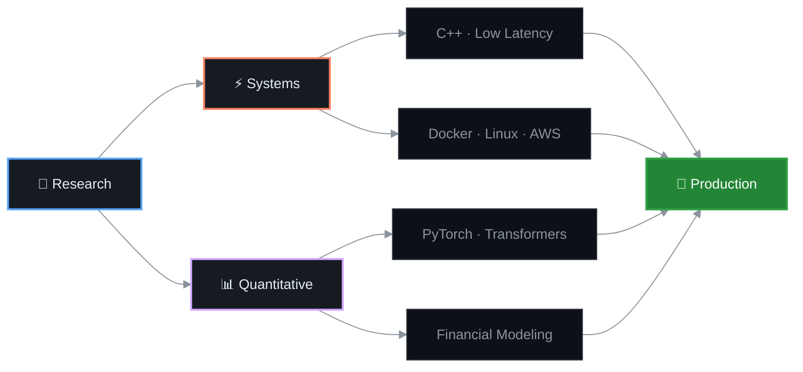

<div align="center">


<br/><br/>


<br/>


<br/><br/>

<a href="https://arpitnayak.netlify.app"></a>&nbsp;
<a href="https://www.linkedin.com/in/the-arpit-nayak/"></a>&nbsp;
<a href="mailto:arpitpupu@outlook.com"></a>&nbsp;
<a href="https://arpitnayak.netlify.app/blogs"></a>&nbsp;
<a href="https://drive.google.com/file/d/1Ez2fVc6iRMQoTaczjwBvCHQzb6La9Yag/view?usp=sharing"></a>

<br/><br/>

</div>

<!-- ═══════════════════════════════════════════════════ -->

<table>
<tr>
<td width="50%" valign="top">

### &nbsp;&nbsp;📡&nbsp; Status

```yaml
location:    India
education:   BS Data Science — IIT Madras
focus:       Low-latency systems & quantitative finance
open_source:
  - VLC Media Player (3B+ downloads)
  - Joplin (50K+ ★)
status:      Available for collaboration
```

</td>
<td width="50%" valign="top">

### &nbsp;&nbsp;⚙️&nbsp; Core Stack

```
   ╭──────────────────────────────────────╮
   │                                      │
   │   C++  ·  Python  ·  TypeScript      │
   │   Kotlin  ·  Bash                    │
   │                                      │
   │   React  ·  FastAPI  ·  Next.js      │
   │   PyTorch  ·  Docker  ·  AWS         │
   │   PostgreSQL  ·  Redis  ·  Linux     │
   │                                      │
   ╰──────────────────────────────────────╯
```

</td>
</tr>
</table>

<!-- ═══════════════════════════════════════════════════ -->

<br/>

<div align="center">



</div>

<br/>

<!-- ═══════════════════════════════════════════════════ -->

<details>
<summary><b>&nbsp;&nbsp;🔬&nbsp; Deep Dive — What I Actually Do</b></summary>

<br/>

```
I build systems at the intersection of performance engineering and
machine learning. My work spans from sub-microsecond trading pipelines
in C++ to multi-agent AI orchestration systems.

When I'm not optimizing hot paths, I'm writing about systems design,
quantitative finance, and whatever rabbit hole I fell into at 3 AM.

Open source is non-negotiable. I've shipped code to VLC Media Player
(C/C++ pipeline, 3B+ downloads) and built features for Joplin
(Settings Search, 50K+ ★ on GitHub).

I write daily. Not for engagement — for understanding.
```

<br/>

</details>

<details>
<summary><b>&nbsp;&nbsp;🛠&nbsp; Full Arsenal</b></summary>

<br/>

<div align="center">
<p>

</p>
<p>

</p>
<p>

</p>
<p>

</p>
</div>

<br/>

</details>

<details>
<summary><b>&nbsp;&nbsp;✍️&nbsp; Latest Writing</b></summary>

<br/>

&nbsp;&nbsp;&nbsp;&nbsp;→&nbsp;&nbsp;[**arpitnayak.netlify.app/blogs**](https://arpitnayak.netlify.app/blogs)

&nbsp;&nbsp;&nbsp;&nbsp;I write daily about systems architecture, quantitative finance,
<br/>&nbsp;&nbsp;&nbsp;&nbsp;performance engineering, and developer experience.

<br/>

</details>

<!-- ═══════════════════════════════════════════════════ -->

<br/>

<div align="center">

<a href="https://github.com/ARPIT-NAYAK-LEGEND">


</a>

<br/><br/>

<a href="https://github.com/ARPIT-NAYAK-LEGEND">

</a>

<br/><br/>


<br/>

</div>

<!-- ═══════════════════════════════════════════════════ -->

<br/>

<div align="center">

<picture>
  <source media="(prefers-color-scheme: dark)" srcset="https://raw.githubusercontent.com/ARPIT-NAYAK-LEGEND/ARPIT-NAYAK-LEGEND/output/github-snake-dark.svg" />
  <source media="(prefers-color-scheme: light)" srcset="https://raw.githubusercontent.com/ARPIT-NAYAK-LEGEND/ARPIT-NAYAK-LEGEND/output/github-snake.svg" />
  
</picture>

</div>

<br/>

<!-- ═══════════════════════════════════════════════════ -->

<div align="center">

<br/>


<br/><br/>


<br/>

</div>


